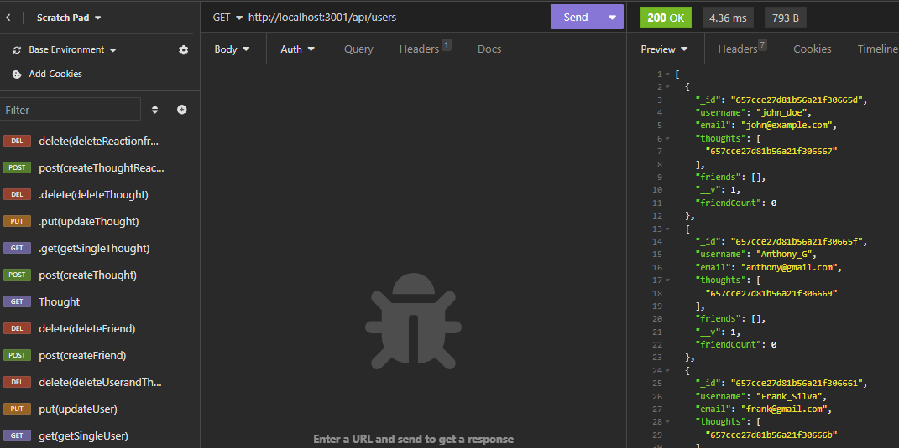

# Social-Network-API

# NoSQL: Social Network API

Back-End of a Social-Network-API application which was built without using SQL.

## Social Network API

Back-End of a Social Network API  which was built using Express.js for routing, MongoDB as the database and Mongoose as the ODM. This API can be used as the backborn for a midium scal social media network.

## User Acceptance Criteria

* Application should invoke when the related command is entered. 
* Then the server is started and the Mongoose models are synced to the MongoDB database.
* User should be able to process API GET routes in Insomnia or any other API platform.
* Then the data for each of these routes is displayed in a formatted JSON
* User should be able to test all the test API POST, PUT, and DELETE routes in Insomnia.
* ALso the user should be able to test API POST and DELETE routes in Insomnia
* Then the user is able to successfully create and delete reactions to thoughts and add and remove friends to a user’s friend list

## Requirements to run the code and to get the outputs

- VS Code, MongoDB, and NPM - Mongoose, Express JS, moment
- MONGODB Compas and Insomnia.
- OS - MS Windows, MAC or any other OS which supports GUI browser display.

## Usage

Screen layout is available in the repository path: 

## Credits

- Lecturers: Gurneesh Singh, Laura Cole and Dani Chankhour for teaching us the modules.
- Tutor Dru Sanchez for guiding me on the module.

  
## Features Links

- Application video demo URL: https://drive.google.com/file/d/1G1EFn_OWSxWFCERWACp5hybXaSG0WpgD/view
- Github Repository URL: https://github.com/anthogr45/Social-Network-API

